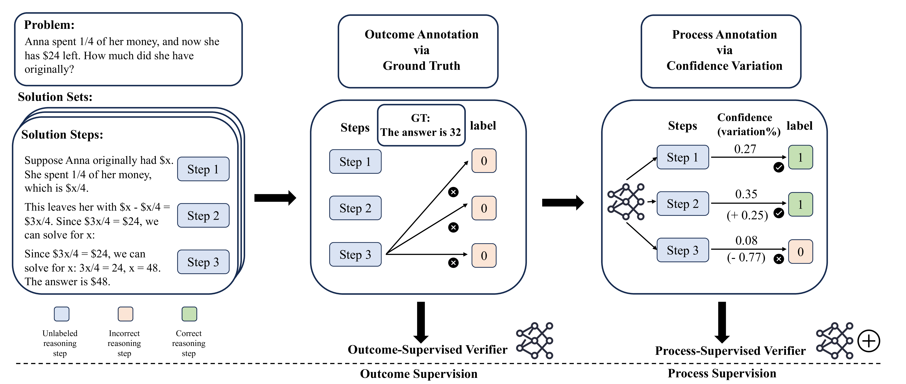

# AUTOCV: Empowering Reasoning with Automated Process Labeling via Confidence Variation

**We will release the code and corresponding finetuned process-enhanced verifier soon.** This repository is the official implementation of [AutoCV: Empowering Reasoning with Automated Process Labeling via Confidence Variation](https://arxiv.org/abs/2405.16802). 

Please note that certain portions of the code are withheld due to confidentiality considerations. As such, we cannot guarantee the smooth execution of the code provided. Efforts are underway to ensure the code complies with open-access requirements before its full release.


##  Overview of the AUTOCV Framework



1. **Outcome-Supervised Verifier:** AUTOCV employs an outcome-based verifier that automatically generates process annotations for each reasoning step by monitoring its own confidence variations, operating independently of ground truth annotations.
2. **Annotation Generation:** The method efficiently produces annotations that serve as process supervision during training large language models (LLMs), eliminating the need for costly manual annotations.
3. **LLM Training:** These generated annotations are utilized to provide targeted supervision during the LLM training phase, enhancing the model's ability to understand and generate reasoning processes.
4. **Continuous Improvement:** As the LLM training progresses, the process-enhanced verifier continuously refines its annotation capabilities based on the evolving quality of the LLM's outputs, creating a feedback loop that improves the verifier interatively.


## Repository Structure


```
AUTOCV/
├── data_annotation.py
├── train.py
└── utils/
    ├── process_verifier_models.py
    ├── states.py
    └── verifier_datasets.py
```

## Contents  [todo] :

1. **data_annotation.py**:

   - This script is crucial for automating data annotation using the AUTOCV framework. It performs two key tasks:
     1. Automated process labeling: It allows the labeling of process information to be automated, substantially improving the efficiency of the data annotation workflow.
     2. Identification of process calculation hallucinations: Utilizes AUTOCV techniques to identify and flag hallucinated process calculations, thereby enhancing the fidelity and trustworthiness of annotations.

2. **train.py**:

   - This script manages the training of AUTOCV verifier models. It outlines the training procedures, encompassing data ingestion, model setup, and optimization for both process- and outcome-supervised verifiers.

3. **utils/**:

   - This directory encapsulates utility scripts crucial for the AUTOCV project's various functions.

     ​       a.**process_verifier_models.py**

     - Implements the verifier models that assess the processes within large language models.
       b. **states.py**:
     - Defines states and related functions integral to the AUTOCV project.
       c. **verifier_datasets.py**:
     - Manages datasets necessary for the training and validation of the project's verifier models.

## Requirements

Before starting, ensure that you've installed all necessary dependencies:

```setup
pip install -r requirements.txt
```

## Training and Evaluation [todo]


## Process-enhanced Verifer Models [todo]

You can access the process-enhanced verifier AUTOCV models here:

- [AUTOCV pretrained model](https://drive.google.com/autocv_pretrained.pth) trained using our advanced process-supervised learning paradigm.

## Results 

Our AUTOCV framework demonstrates state-of-the-art performance in the following settings:


#### Results on Mathematics Benchmarks

| Response Generator | GSM8K Pass@5 | GSM8K Self-Cons. | GSM8K OSV | GSM8K OSV + PSV | MATH Pass@5 | MATH Self-Cons. | MATH OSV | MATH OSV + PSV |
| :----------------- | :----------- | :--------------- | :-------- | :-------------- | :---------- | :-------------- | :------- | :------------- |
| Mistral-Instruct   | 69.90        | 50.03            | 61.18     | **61.41**       | 7.7         | 1.64            | 5.10     | **5.30**       |
| Mixtral-Instruct   | 82.30        | 69.06            | 74.91     | **76.04**       | 22.80       | 10.66           | 15.20    | **16.92**      |
| Qwen               | 91.13        | 81.27            | 84.91     | **85.15**       | 56.10       | **40.10**       | 38.94    | 39.36          |

#### Results on Commonsense Reasoning Benchmarks

| Response Generator | HellaSwag Pass@5 | HellaSwag Self-Cons. | HellaSwag OSV | HellaSwag OSV + PSV | Winogrande Pass@5 | Winogrande Self-Cons. | Winogrande OSV | Winogrande OSV + PSV | ANLI Pass@5 | ANLI Self-Cons. | ANLI OSV | ANLI OSV + PSV |
| :----------------- | :--------------- | :------------------- | :------------ | :------------------ | :---------------- | :-------------------- | :------------- | :------------------- | :---------- | :-------------- | :------- | :------------- |
| Mistral-Instruct   | 76.84            | 40.30                | 73.81         | **74.45**           | 91.16             | 58.64                 | 79.16          | **79.98**            | 73.4        | 45.6            | 59.8     | **59.3**       |
| Mixtral-Instruct   | 84.05            | 73.67                | 82.83         | **83.62**           | 79.16             | 68.75                 | 73.40          | **73.88**            | 68.4        | 59.0            | 62.9     | **64.0**       |
| Qwen-72b           | 95.28            | 85.44                | 93.08         | **93.99**           | 88.63             | 72.21                 | **80.34**      | 79.32                | 82.4        | 63.8            | 69.1     | **71.4**       |


## Contributing

Interested in contributing? We welcome your input and suggestions! Please ensure that your contributions adhere to the guidelines outlined under our license. Feel free to submit issues or pull requests to help us improve the project.

## License

This work is licensed under CC BY 4.0 (Creative Commons Attribution 4.0 International License).


## Citation
If you find the methods and resources provided in this work beneficial, we kindly request that you cite our paper. Below is the BibTeX entry for your convenience:


```bibtex
@article{lu2024autocv,
  title={AutoCV: Empowering Reasoning with Automated Process Labeling via Confidence Variation},
  author={Lu, Jianqiao and Dou, Zhiyang and Wang, Hongru and Cao, Zeyu and Dai, Jianbo and Wan, Yingjia and Huang, Yinya and Guo, Zhijiang},
  journal={arXiv preprint arXiv:2405.16802},
  year={2024}
}
```
